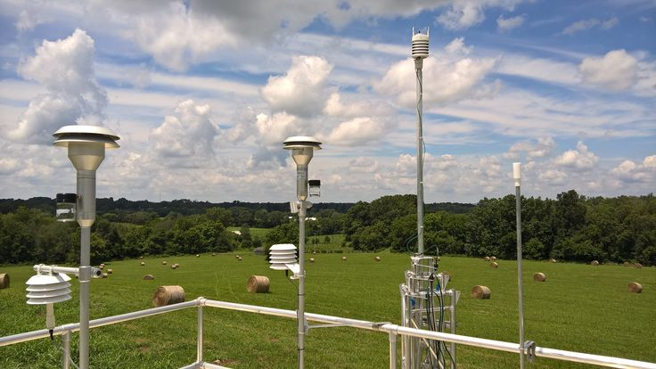
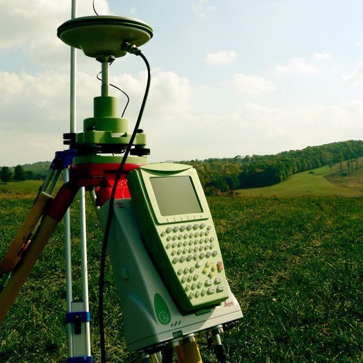

# ClimAct – Climate Action System 🌱🌍


## Overview 🚀
ClimAct is a cutting-edge, real-time climate management dashboard designed to empower individuals and organizations to monitor, analyze, and act on air quality data. Built for speed, scalability, and extensibility, ClimAct seamlessly harmonizes a modern Vercel-powered Next.js frontend with a Flask backend for real-time data streaming and analytics.

---

## Key Features ✨

- **Modern Frontend:** Built with Next.js, styled with Tailwind CSS, and deployed on Vercel for global performance. ⚡
- **Backend:** Flask powers the real-time API, chosen over Dash/Streamlit for its superior real-time data transmission capabilities. 🐍
- **WebSockets:** Real-time pollution data is streamed from a single location initially; premium users unlock access to specific locations. 🔌
- **Supabase Integration:** Authentication (email only), user management, and data storage are handled via Supabase. 🛡️
- **Vo.dev:** Frontend development and rapid prototyping leverage Vo.dev for seamless collaboration and deployment. 🧑‍💻
- **Premium Tiers:** Free users access general data, while Premium users unlock advanced analytics, location-specific data, and more. 💎
- **API Integration:** Clean, RESTful API endpoints for frontend-backend communication. 🔗
- **Beautiful UI:** Custom images and a unique Montserrat font for a fresh, professional look. 🎨

## Real-Time Chatbot Integration 🤖

ClimAct features an integrated, real-time AI-powered chatbot that allows users to ask climate-related questions, receive instant insights, and interact with the dashboard in natural language. The chatbot leverages the backend Flask server for dynamic, context-aware responses and is designed to:

- Provide real-time answers to climate and air quality queries.
- Guide users through dashboard features and analytics.
- Support interactive troubleshooting and educational queries.

**How it works:**
- The chatbot UI is accessible directly from the dashboard.
- Messages are sent via WebSockets or REST API to the Flask backend, which processes queries using advanced AI models.
- Responses are streamed back in real time for a seamless conversational experience.

---

## Real-Time Chatbot Integration 🤖

ClimAct features an integrated, real-time AI-powered chatbot that allows users to ask climate-related questions, receive instant insights, and interact with the dashboard in natural language. The chatbot leverages the backend Flask server for dynamic, context-aware responses and is designed to:

- Provide real-time answers to climate and air quality queries.
- Guide users through dashboard features and analytics.
- Support interactive troubleshooting and educational queries.

**How it works:**
- The chatbot UI is accessible directly from the dashboard.
- Messages are sent via WebSockets or REST API to the Flask backend, which processes queries using advanced AI models.
- Responses are streamed back in real time for a seamless conversational experience.

---

## Features 🖼️

## Real time monitoring




## Real time analytics



## Community involvement


---

## Architecture 🏗️

- **Frontend:** Next.js (React), Tailwind CSS, Vercel, Vo.dev
- **Backend:** Flask (Python), Flask-SocketIO for real-time WebSocket communication
- **Database & Auth:** Supabase (Postgres, JWT, email-only auth)

---

## Why Flask? 🐍
- Flask enables true real-time data transmission, outperforming Dash and Streamlit for this use case.
- WebSocket integration was initially challenging, but successful implementation now enables live updates and analytics.
- Harmonized frontend-backend integration ensures smooth user experience and reliable data flow.

---

## Current Limitations & Next Steps 🛠️
- **Design:** Ensure the UI matches the latest Figma file precisely.
- **Analytics Engine:** Improve the real-time machine learning analytics engine for stability and consistency.
- **Real-Time Map:** Implement a real-time map for live visualization and transmission of air quality data.

---

## Setup & Deployment ⚙️

### Prerequisites 📋
- Node.js, Python 3.10+
- Supabase project (for auth and data)

### Frontend (Next.js on Vercel) 🌐
1. Clone the repo and install dependencies:
   ```sh
   pnpm install
   # or
   npm install
   ```
2. Configure environment variables in `.env.local` (see sample in repo).
3. Deploy to Vercel or run locally:
   ```sh
   pnpm dev
   # or
   npm run dev
   ```

### Backend (Flask) 🐍
1. Install dependencies:
   ```sh
   pip install -r backend/requirements.txt
   ```
2. Run the Flask server:
   ```sh
   python backend/flask_realtime_server.py
   ```

---

## Notes 📝
- Only email authentication is supported (no OAuth or SMS).
- Transmission is initially relayed from a single location; premium users get granular, location-specific access.
- Real-time analytics and map visualization are under active development.
- All images used in the UI are placed in the `public/` folder for easy customization.

---

## Development Environment 💻
This project was developed primarily using the Windsurf IDE, which provided a stable and productive workflow. Some work was attempted in Cursor, but it was unstable and crashed frequently.

---

## Contributing 🤝
Pull requests are welcome! For major changes, please open an issue first to discuss what you would like to change.

---

## License 📄
[MIT](LICENSE)

---

*ClimAct: Real-time climate action for a cleaner tomorrow.*
